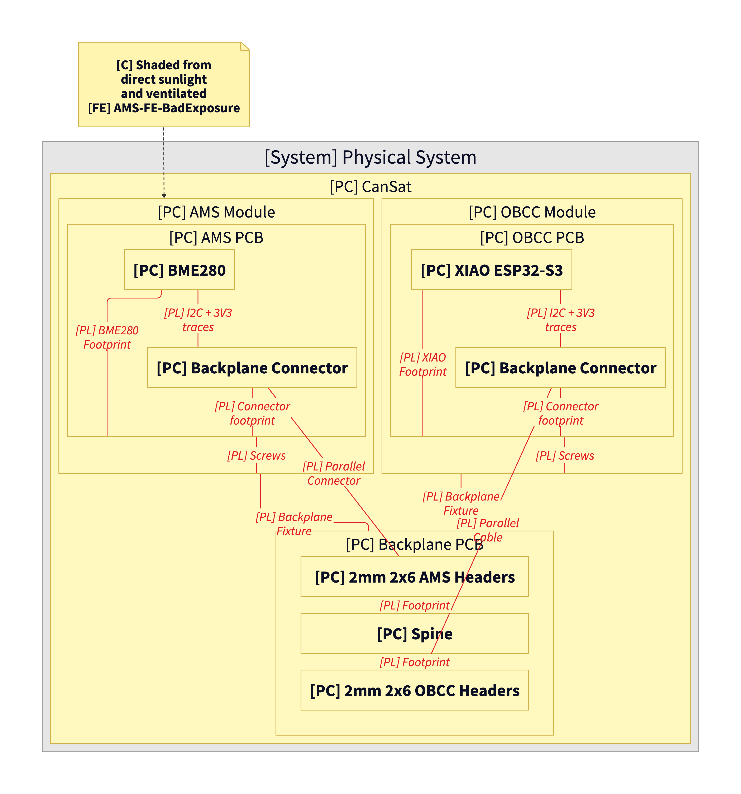
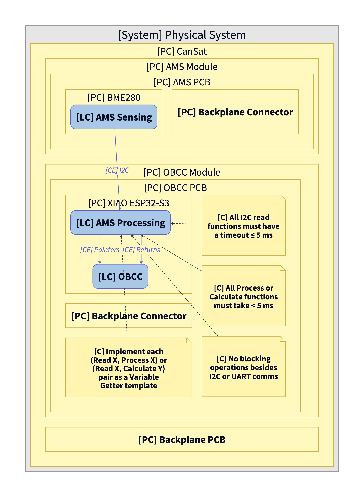
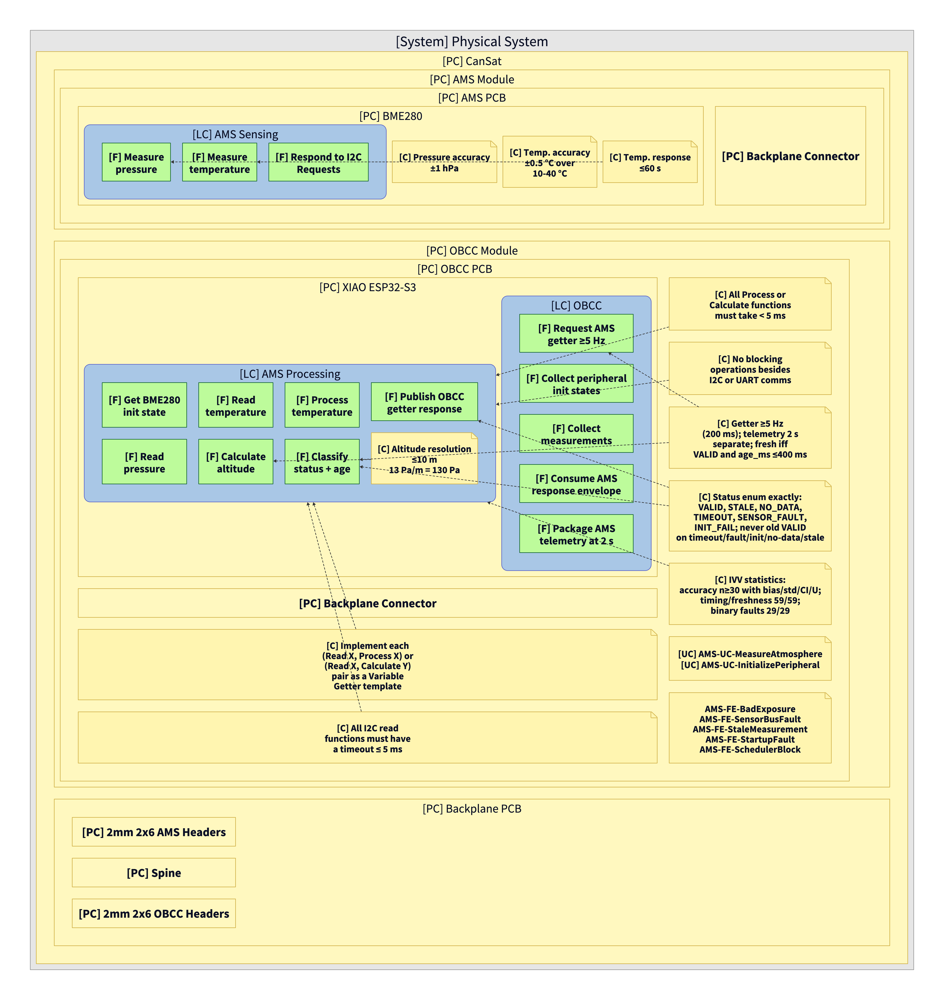
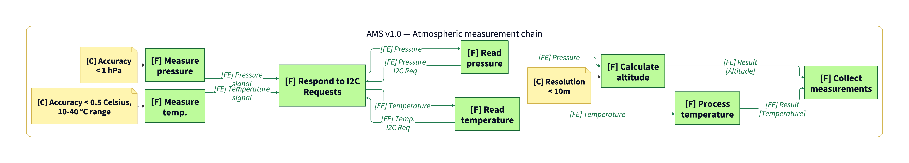
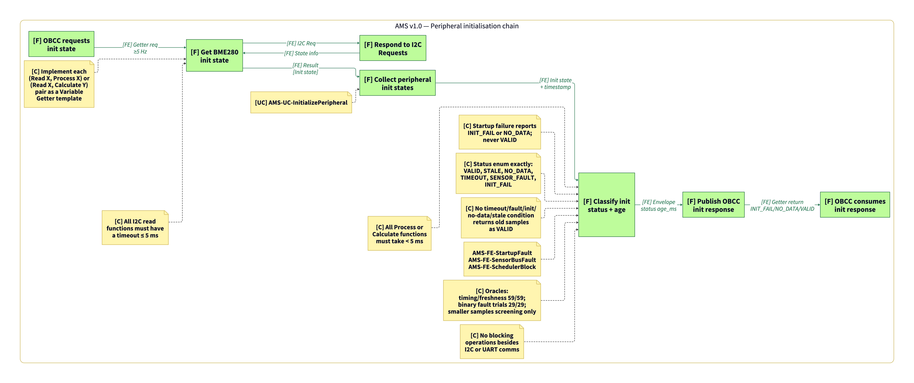
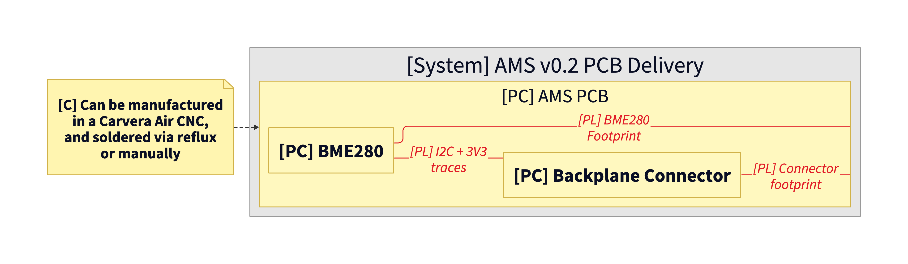

# Atmospheric Measurement System

Owners: @darielmj

This subsystem collects atmospheric data, such as temperature and pressure, which are fundamental for the scientific and research objectives of the mission. Data is sent in real-time to the DPS for analysis, helping to monitor the CanSat’s environmental conditions in flight.

See [Understanding Capella Physical Diagrams](./../PM&SE//Understanding%20Capella%20Physical%20Diagrams/Understanding%20Capella%20Physical%20Diagrams.md) if needed.

See [Variable Getter Template](./../OBCC/Variable%20Getter%20Template.md) if needed.

## Diagram Sources

- [`MBSE/v0.1/`](./MBSE/v0.1/)
- [`MBSE/v0.2/`](./MBSE/v0.2/)
- [`MBSE/v1.0/`](./MBSE/v1.0/)

## Integration, Verification, and Validation (IVV) Plan

### Diagram sets by version

- **v0.1** — [physical PNG](./MBSE/v0.1/AMS_v0.1_view1_physical.png) · [logical PNG](./MBSE/v0.1/AMS_v0.1_view2_logical.png) · [functional allocation PNG](./MBSE/v0.1/AMS_v0.1_view3_functional_allocation.png) · [atmospheric measurement chain PNG](./MBSE/v0.1/AMS_v0.1_view4_atmospheric_measurement_chain.png) · [peripheral initialisation chain PNG](./MBSE/v0.1/AMS_v0.1_view5_peripheral_initialisation_chain.png) · [serial logging chain PNG](./MBSE/v0.1/AMS_v0.1_view6_serial_logging_chain.png)
- **v0.2** — [PCB delivery physical PNG](./MBSE/v0.2/AMS_v0.2_view1_physical.png) · [D2 source](./MBSE/v0.2/AMS_v0.2_view1_physical.d2)
- **v1.0** — [physical PNG](./MBSE/v1.0/AMS_v1.0_view1_physical.png) · [logical PNG](./MBSE/v1.0/AMS_v1.0_view2_logical.png) · [functional allocation PNG](./MBSE/v1.0/AMS_v1.0_view3_functional_allocation.png) · [atmospheric measurement chain PNG](./MBSE/v1.0/AMS_v1.0_view4_atmospheric_measurement_chain.png) · [peripheral initialisation chain PNG](./MBSE/v1.0/AMS_v1.0_view5_peripheral_initialisation_chain.png)

### Latest split views

Latest complete split views are grouped under [`./MBSE/v1.0/`](./MBSE/v1.0/). The PCB-only delivery view is under [`./MBSE/v0.2/`](./MBSE/v0.2/).

View 1 — physical architecture and physical links ([D2 source](./MBSE/v1.0/AMS_v1.0_view1_physical.d2))

View 2 — logical components and component exchanges ([D2 source](./MBSE/v1.0/AMS_v1.0_view2_logical.d2))

View 3 — functional allocation across physical and logical components ([D2 source](./MBSE/v1.0/AMS_v1.0_view3_functional_allocation.d2))

View 4 — atmospheric pressure/temperature polling and processing chain ([D2 source](./MBSE/v1.0/AMS_v1.0_view4_atmospheric_measurement_chain.d2))

View 5 — peripheral initialisation reporting chain ([D2 source](./MBSE/v1.0/AMS_v1.0_view5_peripheral_initialisation_chain.d2))

AMS v0.2 — PCB-only delivery physical view ([D2 source](./MBSE/v0.2/AMS_v0.2_view1_physical.d2))

## Requirements

## System Requirements

Requirements based on the following norms:

- For temperature readings: [ISO-7726:1998  — "Ergonomics of the thermal environment — Instruments for measuring physical quantities.](https://cdn.standards.iteh.ai/samples/14562/0f8ba16a6e4d454f95d38708649e538a/ISO-7726-1998.pdf)
- For atmospheric pressure readings: [WMO-No. 8 (2018) – Guide to Meteorological Instruments and Methods of Observation](https://library.wmo.int/viewer/68695/?offset=3#page=147&viewer=picture&o=bookmark&n=0&q=)
- For pressure-altitude relationship: [ICAO Standard Atmosphere](https://aiac.ma/wp-content/uploads/2018/01/Manuel-de-l%E2%80%99atmosph%C3%A8re-Type-OACI-Doc7488-1.pdf)

| Requirement | Verification method |
| --- | --- |
| The Atmospheric Measurement System must be capable of collecting temperature data in the immediate environment of the CanSat with an accuracy of ±0.5 °C within the range of 10 °C to 40 °C. | Temperature Test |
| The Atmospheric Measurement System must have a response time of no more than 60 seconds for temperature measurements. | Response Time Test |
| The Atmospheric Measurement System must be capable of measuring atmospheric pressure with a precision of at least ±1 hPa and a resolution sufficient to detect altitude changes of 10 meters or less, based on the standard pressure-altitude relationship of 13 Pa per meter. | Flight Test |
| The Atmospheric Measurement System must transmit data in real-time to the On-Board Computer and Communication System (OBCC) with an update rate of at least 5 Hz. | Communication Test |
| The Atmospheric Measurement System must be shaded from direct sunlight and properly ventilated to prevent overheating and to ensure accurate temperature readings. | Visual Inspection Test |

### Pressure Accuracy Estimation

“…for altitudes at which mankind lives, the rate of decrease (lapse rate) for a standard atmosphere may be taken as a reduction of 0.13 mbar per meter of height above sea level…” [source](https://www.sciencedirect.com/science/article/pii/B9780081011232000017)

$$
\frac{\Delta P}{\Delta h}= \frac{0.13 \ \textrm{mbar}}{\textrm{m}} \cdot \frac{100 \ \textrm{Pa}}{1\ \textrm{mbar}} = 13 \ \textrm{Pa}/\textrm{m}
$$

$$
\Delta h_{min}= 5 \ \textrm{m} \Rightarrow \Delta P_{min} = 65 \ \textrm{Pa}
$$

### Success Criteria

The AMS has established a preliminary design capable of accurately measuring temperature and atmospheric pressure, and transmitting this data in real time to the OBCC.

### Old Requirements before PDR

| **Requirement** | **Verification method** |
| --- | --- |
| The Atmosferic Measurement System must be capable of collecting temperature data in the immediate environment of the CanSat with an accuracy of ±10°C. | Temperature Test |
| The Atmosferic Measurement System must be capable of collecting the atmospheric pressure at an accuracy sufficient to detect changes equivalent to a minimum altitude variation of 10 meters, corresponding to a pressure change of 130 Pa, based on a lapse rate of 13 Pa per meter. | Flight Test |
| The Atmospheric Measurement System data needed by flight logic must be delivered internally to the On Board Computer & Communication System (OBCC) with an update rate of at least 5 Hz; this is separate from the v1.0 LoRa telemetry cadence. | Communication Test |

## Components

Temperature and Pressure sensor: **BME280**

[**BME280 Datasheet**](https://www.bosch-sensortec.com/media/boschsensortec/downloads/datasheets/bst-bme280-ds002.pdf)

**Accuracy Stats:**

**Temperature:** ±0.5 °C for temperatures within 0-65 °C

**Pressure:** ±1.0 hPa for temperatures within 0-65 °C.

**Pressure Resolution:** 0.18 Pa

**Pressure Range:** 300-1100 hPa