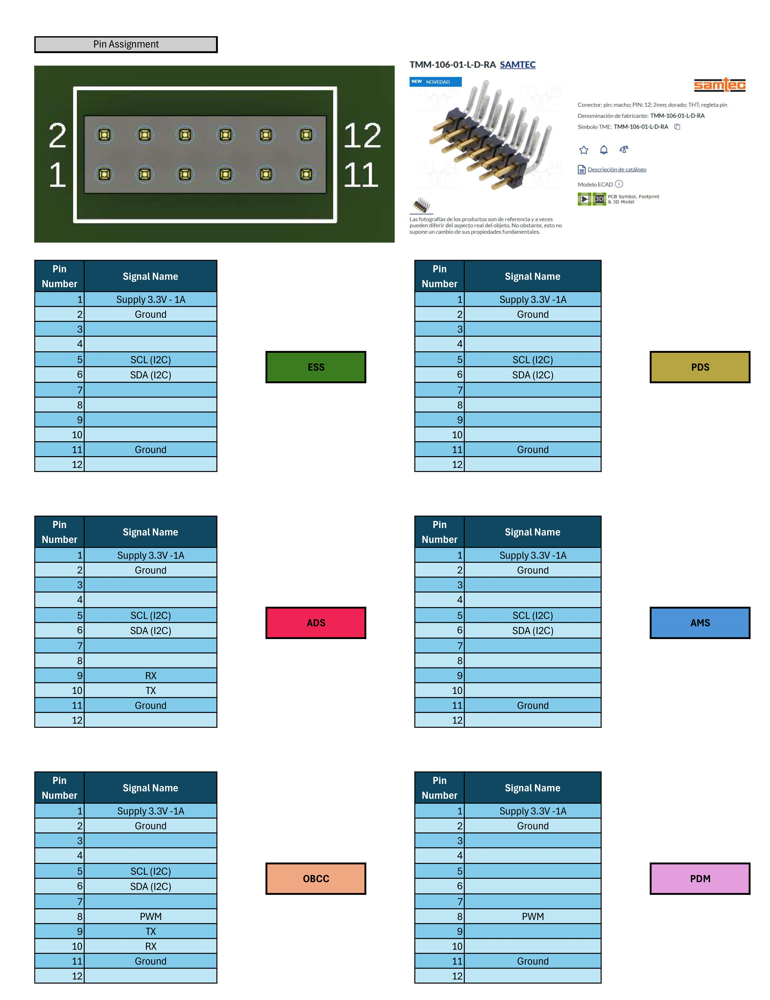

# Backplane

Owners: @KalebG13

The port that i being used in the whole CanSat is [TMM-106-01-L-D-RA SAMTEC](https://www.tme.com/cl/es/details/tmm-106-01-l-d-ra/conectores-placa-placa/samtec/).

This is the pin assignment we will use for the CanSat. If any changes are needed, you can find the [Excel](https://estudianteccr-my.sharepoint.com/:x:/g/personal/kalebgranac13_estudiantec_cr/ETmAzbKWU1ZBgWh_Ee5cvZABLW6a4r9ywtOAFayDHpDFFA?e=c6SHXV) file here.

This is not a standalone subsystem, but it will assist us in working with the BackPlane (BP). The BackPlane helps reduce the rigidity of traditional wiring while providing greater stability for the power and data connections of the entire CanSat.

See [Understanding Capella Physical Diagrams](./../PM&SE/Understanding%20Capella%20Physical%20Diagrams/Understanding%20Capella%20Physical%20Diagrams.md) if needed.

## Requirements

| **Requirement** | **Verification method** |
| --- | --- |
| The Backplane must follow the defined pin interface.  | Visual inspection |
| The backplane shall supply 5.0±0.1V to each subsystem that requieres it, with the least amount of voltage lost across the distribution path. | Power Test |
| The backplane shall supply 3.3±0.1V to each subsystem that requieres it, with the least amount of voltage lost across the distribution path.. | Power Test |
| The backplane should have testpoints in the PCB for critical signal and voltage measurement. | Signal testing |
| The backplane should keep extra low capacitance on the fast communication lines (SPI, I2C & UART). | Signal testing |
| The backplane must follow the Electronic Rules Check (ERC). | Design review by Fusion 360 |
| The backplane must follow the Design Rule Check (DRC). | Design review by Fusion 360 |
| The backplane must use 2 mm 2x6 pin headers for connections to the CanSat subsystems. | Visual Inspection |
| The backplane must have physical dimensions of 100 mm × 28 mm. | Dimensions inspection |
| The backplane shall be composed of a two-layer PCB stackup. | Desing review in Fusion 360 |