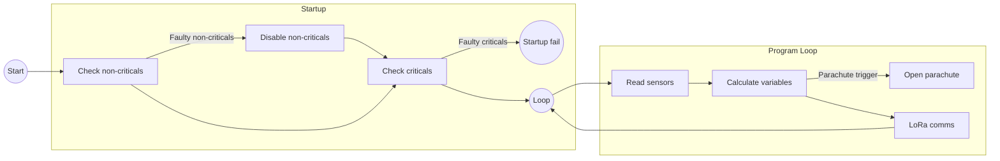

# LoRa Frame

- int16 range: [-32768, 32767]

## Peripherals

| Name | Criticality |
| --- | --- |
| RFM96W | Critical |
| BME280 | Critical |
| Servo | Critical |
| UBX G7020 | Non-critical |
| INA219 | Non-critical |
| MPU6050 | Non-critical |

## Variables

| Name | Unit | Raw type | Range | Decimals | Final type | Final bytes |
| --- | --- | --- | --- | --- | --- | --- |
| Pitch | rad | float | ]-6.29, 6.29[ | 2 | int16 | 2 |
| Roll | rad | float | ]-6.29, 6.29[ | 2 | int16 | 2 |
| Yaw | rad | float | ]-6.29, 6.29[ | 2 | int16 | 2 |
| Angular Speed X | rad/s | float | ]-327.68, 327.68[ | 2 | int16 | 2 |
| Angular Speed Y | rad/s | float | ]-327.68, 327.68[ | 2 | int16 | 2 |
| Angular Speed Z | rad/s | float | ]-327.68, 327.68[ | 2 | int16 | 2 |
| Acceleration X | m/s2 | float | ]-327.68, 327.68[ | 2 | int16 | 2 |
| Acceleration Y | m/s2 | float | ]-327.68, 327.68[ | 2 | int16 | 2 |
| Acceleration Z | m/s2 | float | ]-327.68, 327.68[ | 2 | int16 | 2 |
| Altitude | m | float | [0, 500] | 0 | int16 | 2 |
| Temperature | Celsius | int | [10.0, 40.0] | 1 | int16 | 2 |
| Rel. humidity | % | int | [20, 80] | 0 | int16 | 2 |
| Latitude |  | float | NA | 5 | float | 4 |
| Longitude |  | float | NA | 5 | float | 4 |
| Battery Voltage | V | float | [0.0, 3.7] | 2 | int16 | 2 |
| Battery Current | mA | int | [0, 1500] | 0 | int16 | 2 |

