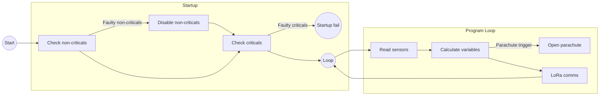

# LoRa Frame

Controlled verification baseline: this table is the active `OBCC-LORA-PAYLOAD-v1.0` variable baseline referenced by [`../PM&SE/contracts/obcc_dps_lora_telemetry_contract.md`](../PM&SE/contracts/obcc_dps_lora_telemetry_contract.md). It defines the active measurement/status payload fields; envelope IDs, command/request fields, schema/version, sequence/timestamp, health/status metadata outside the listed fields, RSSI/SNR evidence, and parser/decoder mappings are controlled by the contract or by execution-specific configuration records. Relative humidity is not part of this active v1.0 payload.

- int16 range: [-32768, 32767]

## Peripherals

| Name | Criticality |
| --- | --- |
| RFM96W | Critical |
| BME280 | Critical |
| Servo | Critical |
| UBX G7020 | Non-critical |
| INA219 | Non-critical |
| ICM20948 | Non-critical |

## Variables

| Name | Unit | Raw type | Range | Decimals | Final type | Final bytes |
| --- | --- | --- | --- | --- | --- | --- |
| Pitch | rad | float | ]-6.29, 6.29[ | 2 | int16 | 2 |
| Roll | rad | float | ]-6.29, 6.29[ | 2 | int16 | 2 |
| Yaw | rad | float | ]-6.29, 6.29[ | 2 | int16 | 2 |
| Angular Speed X | rad/s | float | ]-327.68, 327.68[ | 2 | int16 | 2 |
| Angular Speed Y | rad/s | float | ]-327.68, 327.68[ | 2 | int16 | 2 |
| Angular Speed Z | rad/s | float | ]-327.68, 327.68[ | 2 | int16 | 2 |
| Acceleration X | m/s2 | float | ]-327.68, 327.68[ | 2 | int16 | 2 |
| Acceleration Y | m/s2 | float | ]-327.68, 327.68[ | 2 | int16 | 2 |
| Acceleration Z | m/s2 | float | ]-327.68, 327.68[ | 2 | int16 | 2 |
| Altitude | m | float | [0, 500] | 0 | int16 | 2 |
| Temperature | Celsius | int | [10.0, 40.0] | 1 | int16 | 2 |
| Latitude |  | float | NA | 5 | float | 4 |
| Longitude |  | float | NA | 5 | float | 4 |
| Battery Voltage | V | float | [0.0, 3.7] | 2 | int16 | 2 |
| Battery Current | mA | int | [0, 1500] | 0 | int16 | 2 |
| Parachute Deployment Status (`deployment_status`) | code | uint8 enum | [0, 9] | 0 | uint8 | 1 |

Current variable-table size: **35 bytes** before LoRa envelope, IDs, command/request fields, schema/version, sequence/timestamp, health/status metadata outside the listed fields, RSSI/SNR logging fields, delimiters, or other envelope overhead. This remains within the existing 100-byte OBCC-to-DPS LoRa telemetry frame basis.

## Parachute deployment status enum

`deployment_status` is a one-byte unsigned enum sourced from PDM/actuator confirmation evidence exposed to OBCC or from OBCC-owned deployment/fault-policy interpretation. It is not a command-success shortcut: `COMMAND_SENT` only means OBCC sent an open command. DPS, CSV, dashboard, and report consumers shall treat only `OPEN_CONFIRMED` as deployed/success; all other values, including `UNKNOWN`, are never success.

| Code | Symbol | Meaning |
| --- | --- | --- |
| 0 | `NOT_COMMANDED` | No accepted deployment command/current trigger context. |
| 1 | `INHIBITED_STANDBY` | Request suppressed because OBCC is in Stand-by. |
| 2 | `COMMAND_SENT` | OBCC sent open command; not success by itself. |
| 3 | `OPEN_IN_PROGRESS` | Actuator/PDM response underway, not confirmed. |
| 4 | `OPEN_CONFIRMED` | PDM feedback or independent safe-fixture/current/position observer confirms open; only success/deployed state. |
| 5 | `NO_OPEN_CONFIRMED` | Observer/feedback confirms no open. |
| 6 | `TIMEOUT` | No open confirmation within declared timing window. |
| 7 | `JAM_DETECTED` | Current/position/feedback indicates jam/blocked travel. |
| 8 | `PDM_FAULT` | PDM reports fault or command path unavailable. |
| 9 | `UNKNOWN` | Cannot prove status; never success. |

