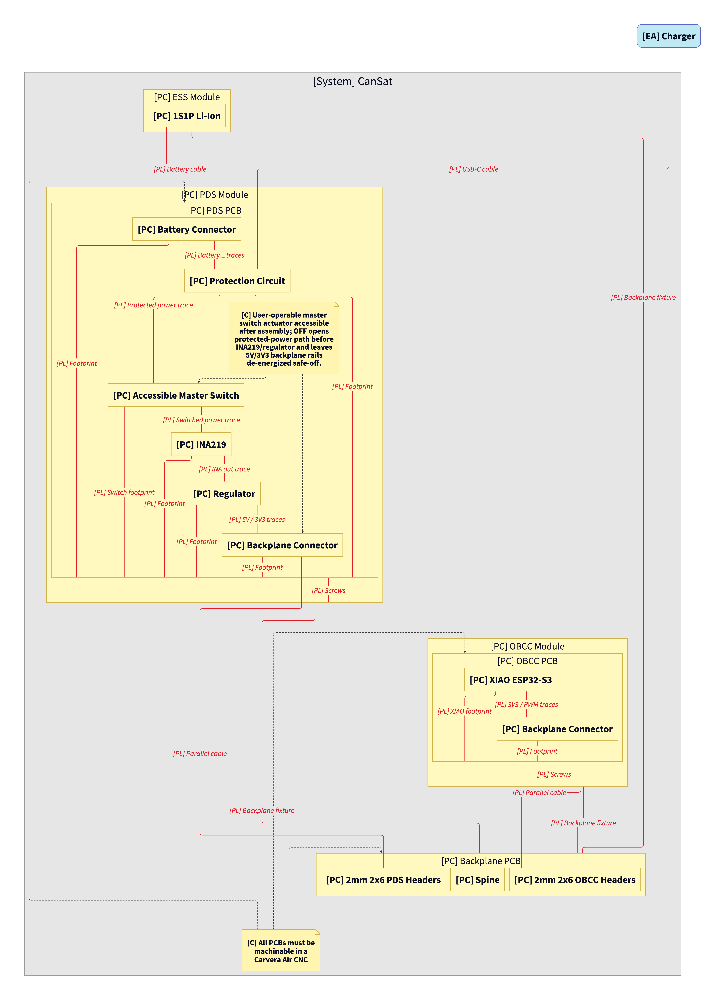
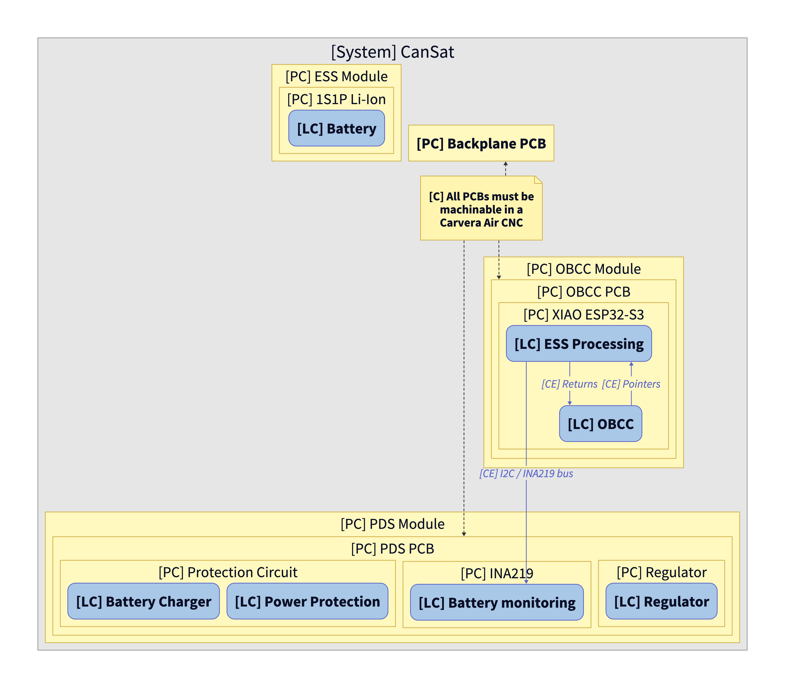
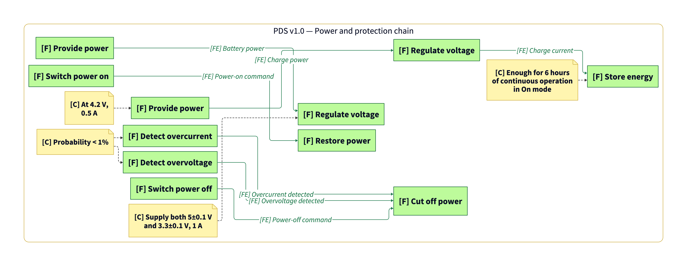
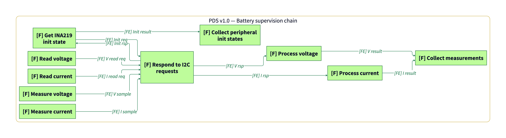

# Power Distribution System

Owners: @GaboArayaIA, @JLPL1503

The power distribution system is responsible for regulating and supplying the necessary energy to all CanSat components. It maintains a stable and safe power flow, with protections to prevent overcurrent failures and ensure the continuous functionality of the systems in operational conditions.

[Power Budget](https://estudianteccr-my.sharepoint.com/:x:/g/personal/joseluispiedra_estudiantec_cr/EUAGHGN1rZlJvwReav6_xnwB106XWC1TTyXf4Vv0bnZCjA?e=fXEnSf)

See [Understanding Capella Physical Diagrams](./../PM&SE/Understanding%20Capella%20Physical%20Diagrams/Understanding%20Capella%20Physical%20Diagrams.md) if needed.

See [Variable Getter Template](./../OBCC/Variable%20Getter%20Template.md) and [LoRa Frame](./../OBCC/LoRa%Frame.md) if needed.

## Diagram Sources

- [`MBSE/v0.1/`](./MBSE/v0.1/)
- [`MBSE/v0.2/`](./MBSE/v0.2/)
- [`MBSE/v0.3/`](./MBSE/v0.3/)
- [`MBSE/v1.0/`](./MBSE/v1.0/)

## Integration, Verification, and Validation (IVV) Plan

### Diagram sets by version

- **v0.1** — [physical PNG](./MBSE/v0.1/PDS_v0.1_view1_physical.d2.png) · [functional allocation PNG](./MBSE/v0.1/PDS_v0.1_view2_functional_allocation.d2.png) · [power chain PNG](./MBSE/v0.1/PDS_v0.1_view3_power_chain.d2.png)
- **v0.2** — [physical PNG](./MBSE/v0.2/PDS_v0.2_view1_physical.d2.png) · [functional allocation PNG](./MBSE/v0.2/PDS_v0.2_view2_functional_allocation.d2.png) · [power chain PNG](./MBSE/v0.2/PDS_v0.2_view3_power_chain.d2.png) · [measurement chain PNG](./MBSE/v0.2/PDS_v0.2_view4_measurement_chain.d2.png)
- **v0.3** — [physical PNG](./MBSE/v0.3/PDS_v0.3_view1_physical.d2.png) · [functional allocation PNG](./MBSE/v0.3/PDS_v0.3_view2_functional_allocation.d2.png) · [power and protection chain PNG](./MBSE/v0.3/PDS_v0.3_view3_power_and_protection_chain.d2.png) · [battery supervision chain PNG](./MBSE/v0.3/PDS_v0.3_view4_battery_supervision_chain.d2.png)
- **v1.0** — [physical PNG](./MBSE/v1.0/PDS_v1.0_view1_physical.d2.png) · [logical PNG](./MBSE/v1.0/PDS_v1.0_view2_logical.d2.png) · [functional allocation PNG](./MBSE/v1.0/PDS_v1.0_view3_functional_allocation.d2.png) · [power and protection chain PNG](./MBSE/v1.0/PDS_v1.0_view4_power_and_protection_chain.d2.png) · [battery supervision chain PNG](./MBSE/v1.0/PDS_v1.0_view5_battery_supervision_chain.d2.png)

### Latest split views

Latest available split views are grouped under [`./MBSE/v1.0/`](./MBSE/v1.0/).

View 1 — physical architecture and physical links ([D2 source](./MBSE/v1.0/PDS_v1.0_view1_physical.d2))

View 2 — logical components and software exchanges ([D2 source](./MBSE/v1.0/PDS_v1.0_view2_logical.d2))

View 3 — functional allocation across physical and logical components ([D2 source](./MBSE/v1.0/PDS_v1.0_view3_functional_allocation.d2))

View 4 — power delivery and protection functional chain ([D2 source](./MBSE/v1.0/PDS_v1.0_view4_power_and_protection_chain.d2))

View 5 — battery supervision and software chain ([D2 source](./MBSE/v1.0/PDS_v1.0_view5_battery_supervision_chain.d2))

## Requirements

| **Requirement** | **Verification method** |
| --- | --- |
| The power distribution system must continuously supply 3.3±0.1 V and 1 A, with an efficiency of 95%. | Power Test |
| The power distribution system must con tinuously supply 5±0.1 V and 1 A, with an efficiency of 95%. | Power Test |
| The system must be capable of recover automatically after a fault. | Automatic Recovery Test |

### Success Criteria

The PDS presents a design that ensures stable and efficient power delivery at required voltage and current levels, including automatic recovery capabilities in the event of a fault.

## Energy Storage System (ESS)

Owners: @suazo17-b, @JLPL1503, @GaboArayaIA

This subsystem stores the energy that powers the CanSat throughout the mission. It uses rechargeable batteries to ensure a constant power supply, allowing for real-time charge level monitoring and maintaining sufficient reserves for the full duration of the mission.

[Power consumption](https://estudianteccr-my.sharepoint.com/:f:/g/personal/joseluispiedra_estudiantec_cr/EpSWPNBgBAdAve6ipVGJFFABVRmRue6xLyDfNM8e962nQw?e=O112Hq)

[Datasheets](https://estudianteccr-my.sharepoint.com/:f:/g/personal/joseluispiedra_estudiantec_cr/EpSWPNBgBAdAve6ipVGJFFABVRmRue6xLyDfNM8e962nQw?e=O112Hq)

## Requirements

| **Requirement** | **Verification method** |
| --- | --- |
| The Energy Storage System must provide energy for at least 6 hours of stand-by operation. | Energy on Stand-By Test |
| The Energy Storage System battery must use a 1S1P Li-Ion rechargeable cell/pack architecture (3.7 V nominal). Rechargeable through an external port. | Battery Inspection |
| The  Energy Storage System must include voltage, current and power sensor for the batteries. | Power test |

### Success Criteria

The ESS demonstrates its ability to provide power for at least 6 hours in stand-by mode, includes essential battery monitoring sensors, and conforms to the specified external-charging and 1S1P Li-Ion electrical configuration requirements.