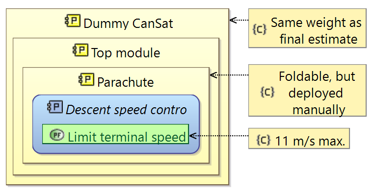
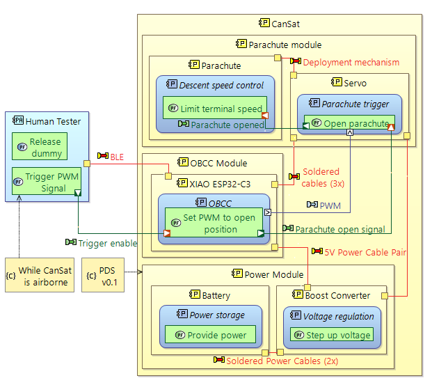

# Parachute Deployment Mechanism

Owners: @prigo11, @secoher26 

The function of this subsystem is to reliably deploy the parachute, controlling the descent speed of the CanSat for a safe landing. This mechanism automatically activates the parachute upon reaching a specified altitude or conditions, using an electromechanical system that ensures precise and successful deployment.

See [Understanding Capella Physical Diagrams](./../..//Understanding%20Capella%20Physical%20Diagrams/Understanding%20Capella%20Physical%20Diagrams.md) if needed.

## Integration, Verification, and Validation (IVV) Plan

PDM v0.1 structure. The dummy CanSat is S&A v0.1.

 CanSat guide.](PDM_v0.1_FC.png)
PDM v0.1 fall test functional chain. Terminal speed taken from [ESA](https://cansat.esa.int/wp-content/uploads/2023/09/T10_Parachute_Design_EN.pdf) CanSat guide.

PDM v0.2 structure.

PDM v0.2 parachute deployment test functional chain.

## Requirements

| **Requirement** | **Verification method** |
| --- | --- |
| The parachute deployment system must ensure a 100% success rate under predetermined atmospheric pressure and descent velocity conditions. | Flight Test |
| The mechanism must be able to activate the parachute within a maximum of 5 seconds after detecting the deployment point. | Simulations & Drop Test |
| The system must include the electromechanical activation system to avoid failures in parachute deployment. | Drop Test |
| The parachute must be designed with a maximum diameter of 30 cm, depending on verification points and mission requirements. | Parachute inspection |

### Success Criteria

The PDM subsystem has defined a reliable preliminary design capable of deploying the parachute within specified atmospheric conditions and timing constraints, while mitigating failure risks through electromechanical safeguards.